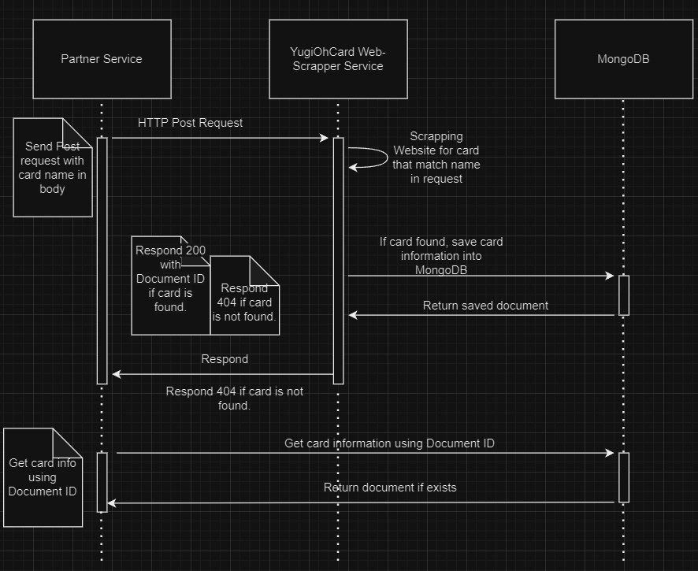

## How to programmatically REQUEST data:
Create a http post request to call the microservice

**Sample curl request:**
```
curl --location 'http://localhost:4000/findCard' \
--header 'Content-Type: application/json' \
--data '{
    "name": "Dragon"
}'
```

**Sample Python Code to do http request:**
```
url = 'http://localhost:4000/findCard'
myobj = {
    'name': 'Dragon'
}
respond = requests.post(url, json = myobj)
```

## How to programmatically RECEIVE data:
Receive data into respond variable in above code snippet

- Success request will have the card found and stored information in MongoDB and receive status-code 200 respond with Document ID

- If card is not found, data received will be status-code 404

- Encounting error while service is handling request, data received will be status-code 400

**Sample success request data received:**
```
Respond status: 200
Respond body: "65dd76ec8d5b2f8ba3d49f18"
```

**Sample Fail request data received when card is not found by service:**
```
Respond status: 404
Respond body: "Could not find card from web"
```

**Sample Fail request data received when error happens during service call:**
```
Respond status: 400
Respond body: "Error while handling request"
```

## UML Sequence Diagram:

